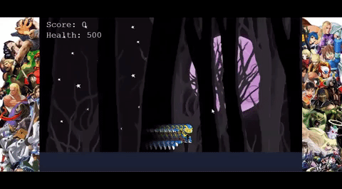
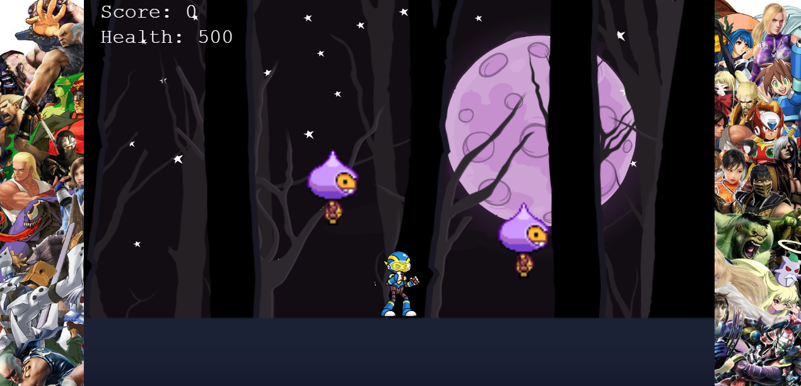
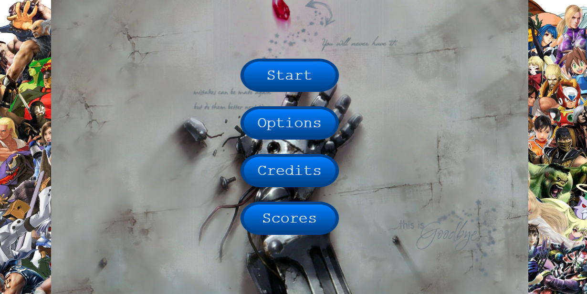

# RoboBlaster Game

This is a MegaMan-inspired shooter-platformer game built with Phaser 4. Control a robot, defeat enemies, collect hearts, and get the highest score. You only need a keyboard and browser to play.

## Built With

- Phaser 4
- JavaScript (ES6 Modules)
- Webpack
- Jest
- CSS3

## Requirements

- [Node.js](https://nodejs.org) to install dependencies and run scripts via `npm`.
- A modern web browser.
- Internet connection (for leaderboard API).

## Live Version

[Click here to play](https://robo-blaster-game.netlify.app/)

## How to Play

- ⬅️ Press the left arrow key to move left.
- ➡️ Press the right arrow key to move right.
- ⬆️ Press the up arrow key or the space bar to jump (double jump available).
- ⬇️ Press down to fast fall.
- Q Press the 'Q' key for dash ability.
- W Press the 'W' key for Blade (melee) attack.
- E Press the 'E' key for Shoot energy blast.

## Instructions

- Stay away from enemies.
- Use Dash (Q) to avoid them.
- Use Blade (W) for high-damage melee attacks.
- Use Blast (E) for ranged attacks.
- Collect hearts to increase your max HP.
- Defeat enemies to earn points.
- **New enemy: SkullFire** — floats vertically and **paralyzes** you on contact (3 seconds).

## Authors

👤 **Pablo Alexis Zambrano Coral**
- Github: [@Alexoid1](https://github.com/Alexoid1)
- Twitter: [@Alexis Zambrano_acz](https://twitter.com/pablo_acz)
- Linkedin: [linkedin](https://www.linkedin.com/in/alexzambranocoral/)

## Available Commands

| Command | Description |
|---------|-------------|
| `npm install` | Install project dependencies |
| `npm start` | Build project and open web server running project |
| `npm run build` | Builds code bundle with production settings (minification, uglification, etc.) |
| `npm run test` | Run tests |

## Show your support

Give a ⭐️ if you like this project!
