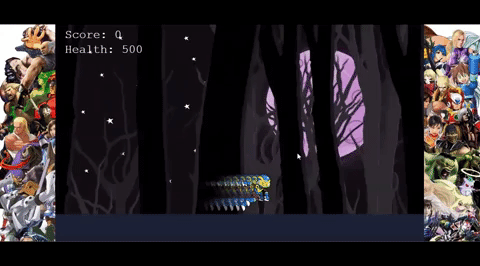

# RoboBlaster Game

This is a game that a build inspired by megaman series you only need a keyboard and a browser to play it, build in phaser 3, the objective of this game is get the highest score beating enemies and care that your Health points dont reach to zero.

## Built With

 - Phaser 3
 - JavaScript
 - Webpack
 - Jest
 - Css

## Requirements

 - [Node.js](https://nodejs.org) is required to install dependencies and run scripts via `npm`.
 - Browser 
 - Internet

## Live Version
[Click here to play](https://robo-blaster-game.netlify.app/)

## How to Play

- ⬅️  Press the left arrow key to move left.
- ➡️  Press the right arrow key to move right
- ⬆️  Press the up arrow key or the space bar to jump.
- ⬇️  Land fast.
- Q   Press the 'Q' key for dash ability.
- W   Press the 'W' key for Blade ability.
- E   Press the 'E' key for Shoot energy blast.

## Instruction
 - Stay away of the enemies
 - Use Dash Ability to avoid them
 - Use Blade ability to attack (high damage)
 - Use Blast ability to attack
 - Try to make the highest score
 - Stay tune for next to come

## Authors

👤 **Pablo Alexis Zambrano Coral**
- Github: [@Alexoid1](https://github.com/Alexoid1)
- Twitter: [@Alexis Zambrano_acz](https://twitter.com/pablo_acz)
- Linkedin: [linkedin](https://www.linkedin.com/in/alexzambranocoral/)

## Available Commands

| Command | Description |
|---------|-------------|
| `npm install` | Install project dependencies |
| `npm start` | Build project and open web server running project |
| `npm run build` | Builds code bundle with production settings (minification, uglification, etc.|
| `npm run test` | Run test |

## Show your support

Give a ⭐️ if you like this project!

